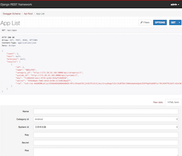

# HotFix
HotFix restful api

# Design
1. Backend: REST API
2. Frontend: Web-apps
3. Using external storage services

# Requirements
* Python 3.6+
* Django 1.11.4+
* [More](requirements.txt?raw=true)

# INSTALL
1. download source
    ```
    git clone https://github.com/hotfix-project/hotfix-api.git
    ```
2. install python modules
    ```
    cd hotfix-api
    pip3.6 install -r requirements.txt
    ```
3. install mysql
    ```
    yum install mariadb-server mariadb-devel mariadb

    systemctl start mariadb
    systemctl enable mariadb
    mysql_secure_installation
    firewall-cmd --permanent --add-service mysql
    systemctl restart firewalld.service
    ```
4. init database
    ```
    sh init_db.sh
    ```
5. run
    ```  
    sh startup.sh
    ```

# Presentation

Click thumbnails to enlarge.

## Managing Categorys
[](screenshots/category.png?raw=true)

## Managing Systems
[](screenshots/system.png?raw=true)

## Managing APPs
[](screenshots/app.png?raw=true)

## Managing Versions
[](screenshots/version.png?raw=true)

## Managing Patchs
[](screenshots/patch.png?raw=true)


# Client workflow
1. Checkout update
2. Download patch&Decrypt patch&Verification patch&Apply patch
3. Report update status
